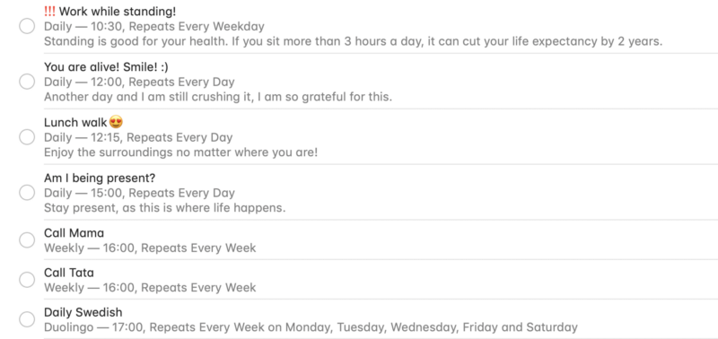

> “We become what we repeatedly do.” ― **Sean Covey**

](./asset-1.jpeg)

In my previous article, I've explained what are habits, how are they formed and why should you care about them. I also mentioned briefly that habits could be hacked and used for our benefits. Let's see how is that possible.

### A positive habit? What's that?

A positive habit is just a simple habit, but one which adds value to your life. It helps you to make a step every day towards your goal.

Yes, habits can be positive and they can take your life to the next level. With the right habits, you can learn new languages, read dozens of books, live healthily and create incredible things. As my dear colleague, [Casey](https://www.linkedin.com/in/caseybitzberger/), said, "_habits are like little keys to unlock your potential._"

The impressive thing about habits is their compounding effect. By doing only **1%** more today than yesterday, you can go really far over the course of a year. Remember, you are in for the long run.

> “Overnight success stories take a long time.” ~ Steve Jobs

### TBD

Whenever you would like to develop a new routine, you should think a little bit about the logistics(_what_, _when_, _how_) around the process and your motivation of **why** would you like to acquire that habit. 

There will be days when you will have zero energy to take action. By having a goal in mind, it will be easier to stick to the plan even if you don't feel like doing anything.

It’s also likely that your situation will change along the way. You travel for a week, move into a new apartment, have more on your plate, etc. It is important to adjust your strategy to new situations all the time.

#### Decide on the cue

This is an important part of the equation. The cue is responsible for removing the thinking behind the action, triggering the habit and making it feel automatic. 

The cue can be anything. It can be a place, a feeling, an action or even a person. Whenever you wake up, arrive home or meet a group of people, just to name a few.

Whenever the cue is triggered, it strengthens its association with the action, making it easier to be triggered the next time. If activated frequently, you will start performing the respective habit on autopilot.

#### Know your motivation

Without being aware of why you want to do develop a new habit, it will be hard to stick to the plan, once you encounter difficulties. Your motivation does not to be complex though, just make sure to have one.

For example, there is no reason to wake up at 5 am, if you don't know what to do with all the extra time. 

#### Be selective

There are a lot of people on the internet(like me) telling you what could you do to take your life to the next level. And it is tempting to fall into the self-development trap and try to do it all at the same time. 

But you can't and you shouldn't jump on every bandwagon. [This video](https://www.youtube.com/watch?v=tTjAAK8YsYk) by one of my [favorite YouTubers](https://www.youtube.com/channel/UCJ24N4O0bP7LGLBDvye7oCA) is a great explanation of the problem. 

If something sounds appealing, try it. But if you realize that it is not for you, just stop with it. We are all different and nothing is a silver bullet which is going to be effective for everyone.

### Tips to acquire positive habits

#### **Start small** 

Implementing a new habit is challenging, no matter what. If you push yourself too much, it is going to be difficult to persist in the long run and you will be back at square one in a matter of days.

Instead of exercising 5 days a week, try first with only 1–2 times. Wake up only 10 minutes earlier. Read 10 pages every day. You get the point. 

Once the small change is working, you can go and scale it up. Just always do it gradually.

#### Track your progress

Every day you have only one goal: to not break the streak. 

By tracking your habits, you will be able to see the amount of work you've done in the past and this will push you to do the work today as well. You don't want to let yourself down, right?

If you see that in the last 4 weeks you showed up every day, that will motivate you to show up today as well and increase that streak.

You can use an [app](https://habitica.com/static/home), a journal or a calendar, it does not matter. Check out [this excellent article](https://jamesclear.com/habit-tracker) by James Clear, the author of [_Atomic Habits_](https://amzn.to/2VTAW2I) if you want to learn more about how and why should you track your progress.

#### Remind yourself

This one is really important for me, especially when I want to acquire a new habit. In the beginning, our brains are not wired to perform the action on autopilot and we tend to forget to show up.

I love to set up reminders, whenever I want to incorporate something into my life. The task will not disappear until I mark it as done and this feature prevents me from forgetting about it.

As you can see in the image above, I have reminders for a lot of different things. And it actually works!

Since starting to use this system, I managed to almost double my daily steps, work standing every day, take walks around lunchtime and learn conversational Spanish, just to name a few.

### Final thoughts

So what can you do now to start implementing positive habits in your life?

###   

Thanks for reading, and subscribe to do not miss out on any of my future posts! 🙏

### About the author

Robert is a full-stack web developer, currently working at [Relatable](https://bit.ly/2WQyMOn). He loves to inspire people, explore new places, read great books, take inspiring pictures and learn new stuff all the time.

Follow him on [LinkedIn](https://bit.ly/2OMrsAp), [Instagram](https://bit.ly/2TQxvVu), [GitHub](https://bit.ly/2Vk7Fup), [Goodreads](https://bit.ly/2HYH9DQ) or here, on [Medium](https://bit.ly/2HYayho).
