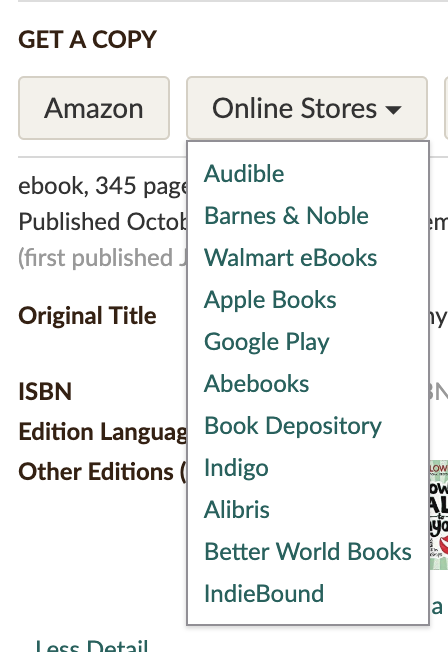

Photo by [Alfons Morales](https://unsplash.com/photos/YLSwjSy7stw?utm_source=unsplash&utm_medium=referral&utm_content=creditCopyText) on [Unsplash](https://unsplash.com/search/photos/book?utm_source=unsplash&utm_medium=referral&utm_content=creditCopyText)

To be honest, it is hard to believe that I managed to finish 100 books in the last three years. If you had told me this back then, I would have laughed at you.

At that time, I was not reading that much. A couple of books here and there, mostly during holidays and usually only fiction. 

The whole process seemed too complex. Find a good book to read, get the physical copy of it and block off time to actually read it. Too many steps, why not just skip it and play video games instead? And I did. I chose the easier path.

### What happened?

I got a [Kindle](https://amzn.to/2JOiofh) e-reader and the process got simpler.

While all of the steps mentioned before still existed, it became way easier to tackle them.

#### 1\. Find a good book

I quickly realized that this step is only hard in the beginning, no matter the format of books. After I've read my very [first non-fiction](https://www.goodreads.com/book/show/35210.How_to_Talk_to_Anyone), my reading list started to grow exponentially and it still does to this day. 

Thanks to podcasts, friends, traveling and blogs, I continue to grow this list with interesting books every day.

Nowadays, finding a good book is as easy, as looking through my [_"Want to read"_](https://www.goodreads.com/review/list/52810400) list on Goodreads and pick one. 

#### 2\. Get a copy of it

Having thousands of books in your pocket is the coolest thing about having a Kindle. Getting new books is as easy, as going online and finding them at one of the stores. 

Goodreads gives you a great overview of the various places where you can find a specific book.

  

#### 3\. Blocking out time to read

While having a physical copy of a book has its beauty, it needs more thoughts around reading circumstances. Carrying them around is a hassle and it is hard to hold one while standing.

Having an e-reader makes these problems disappear. I often carry my Kindle in my back pocket and I grab it whenever I have a few minutes to kill. Waiting for someone, commuting to work and traveling are all extra opportunities to read several pages.

I still love blocking out time to read in a more relaxed setup though, but having my Kindle with me all the time makes it possible to read much more than I could by solely relying on those special occasions.

### How could you start reading more from now?

#### 1\. Get a Kindle

You could guess by now, I love e-readers. 

Its portability will make it an ease to have with you all the time. You will be able to read no matter where you are(just not while driving please, that is dangerous). You don't even need to sit down, as it is lightweight enough to hold it in one hand.

You also save a lot of time by not going to a book store/library to get new books. Once you are finished, you can go online and get a new one, it is that easy. And the best part? Your device can hold thousands of books at the same time!

Not having to deal with logistics(shipping, printing, rent for the store, etc.) makes the price of an e-book much more affordable. There are even thousands of books online you can get for free!

Even though there are different e-readers on the market, I would recommend you to get a [Kindle](https://amzn.to/2JOiofh). The ecosystem that Amazon has built around the Kindle makes getting new books a breeze, the devices are high quality and they are affordable([fun fact, Amazon does not even make a profit on Kindles](https://www.forbes.com/sites/kellyclay/2012/10/12/amazon-confirms-it-makes-no-profit-on-kindles/#221416136b43)).

Without having my Kindle, I would not have been able to read 100 books in the last 3 years, for sure.

#### 2\. Make it a habit

Reading is a habit and in order to acquire it, you want to work on it every day. [According to science](https://bit.ly/2TpuwnG), it takes on average 66 days to form a new habit, depending also on the complexity of it.

In order for a habit to stick, you want to do it every day. When I started to read, I promised myself to stop using any electronics at least 1 hour before going to bed and devote that time to reading instead. This had the double benefit of blocking out quality time to read and avoiding blue light before sleep.

Instead of reaching to your phone to check Instagram while having 2 minutes to kill, try grabbing your Kindle and read a few pages. This will help to train your brain to read whenever you have some free time. It will also help you to reduce social media usage, which is always a good thing.

#### 3\. Set a goal

Goodreads is a really good place to track progress. They have this thing called the "yearly reading challenge", where you can say how many books would you like to read during a year. 

This adds an extra fun thing to the process. It makes possible tracking your progress along the way. It also shows all the time if you are on track to hit your proposed number which can warn you if you need to read more to get there.

Start by committing to 12 books for the year. That is only one book a month, which should be doable for anyone who is serious about this.

#### 4\. Find books that you enjoy

This may sound obvious, but if you repeatedly read books that you don't enjoy, it can become boring quite fast. There are many excellent books out there, so if you don't like one, just put it down and find a new one. Life is too short to read boring books.

### Final thoughts

What is your experience with reading? What is your go-to strategy to achieve your reading goals? Do you own a Kindle or read physical books? What is blocking you to read?

Feel free to share your thoughts about the ideas expressed in this post, don't be afraid to ask questions or just reach out on any of the socials listed below if you would like to nerd out about reding.

Thanks for reading! 🙏

### About the author

Robert is a full-stack web developer, currently working at [Relatable](https://bit.ly/2WQyMOn). He loves to inspire people, explore new places, read great books, take inspiring pictures and learn new stuff constantly.

Follow him on [LinkedIn](https://bit.ly/2OMrsAp), [Instagram](https://bit.ly/2TQxvVu), [GitHub](https://bit.ly/2Vk7Fup), [Goodreads](https://bit.ly/2HYH9DQ) or here, on [Medium](https://bit.ly/2HYayho).
